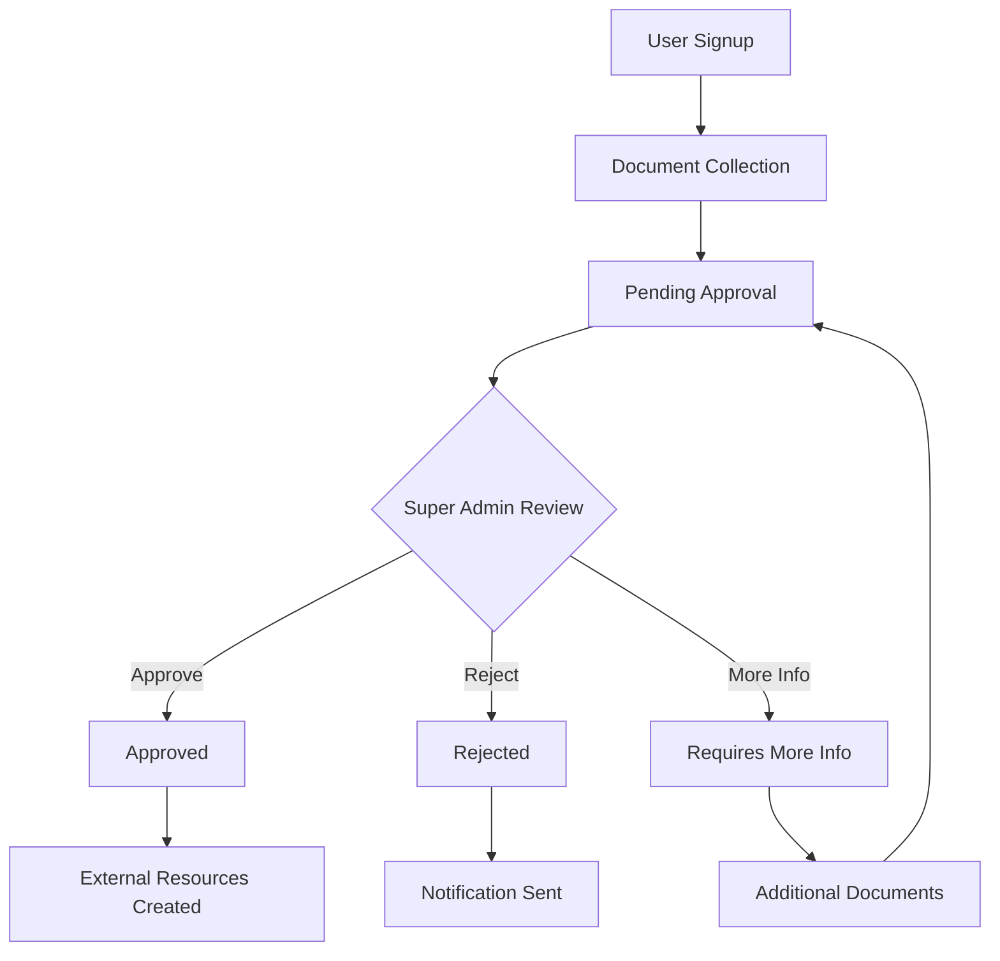

# Organization Approval System Implementation

## Overview

This document outlines the implementation of a comprehensive organization approval system with super admin oversight, document collection, customer access control, and duplicate management features.

## Table of Contents

1. [Architecture Overview](#architecture-overview)
2. [Database Schema Changes](#database-schema-changes)
3. [Super Admin System](#super-admin-system)
4. [Document Collection System](#document-collection-system)
5. [Organization Approval Workflow](#organization-approval-workflow)
6. [Customer Access Control](#customer-access-control)
7. [Duplicate Detection & Merging](#duplicate-detection--merging)
8. [Email System](#email-system)
9. [UI Components](#ui-components)
10. [Implementation Steps](#implementation-steps)

## Architecture Overview

### System Flow
```
User Signup → Document Collection → Pending Approval → Super Admin Review → Approved/Rejected
                                                     ↓
                                              External Resources Created
                                              (Vapi, Twilio, Resend)
```

### Key Components
- **Super Admin Role**: Cross-tenant administrative access
- **Approval States**: `pending`, `approved`, `rejected`, `requires_more_info`
- **Document Management**: Secure file upload and storage
- **Customer Assignment**: Role-based customer access control
- **Duplicate Detection**: Automated duplicate identification and merging

## Database Schema Changes

### New Tables

#### `organization_documents`
```sql
CREATE TABLE organization_documents (
    id UUID PRIMARY KEY DEFAULT uuid_generate_v4(),
    tenant_id TEXT NOT NULL REFERENCES tenants(id) ON DELETE CASCADE,
    document_type TEXT NOT NULL, -- 'business_registration', 'tax_id', 'address_proof', etc.
    file_name TEXT NOT NULL,
    file_path TEXT NOT NULL,
    file_size BIGINT NOT NULL,
    mime_type TEXT NOT NULL,
    uploaded_by UUID REFERENCES user_accounts(id),
    upload_date TIMESTAMPTZ DEFAULT NOW(),
    status TEXT DEFAULT 'pending', -- 'pending', 'approved', 'rejected'
    rejection_reason TEXT,
    created_at TIMESTAMPTZ DEFAULT NOW(),
    updated_at TIMESTAMPTZ DEFAULT NOW()
);
```

#### `organization_approval_history`
```sql
CREATE TABLE organization_approval_history (
    id UUID PRIMARY KEY DEFAULT uuid_generate_v4(),
    tenant_id TEXT NOT NULL REFERENCES tenants(id) ON DELETE CASCADE,
    previous_status TEXT,
    new_status TEXT NOT NULL,
    changed_by UUID REFERENCES user_accounts(id),
    reason TEXT,
    additional_info_requested TEXT,
    created_at TIMESTAMPTZ DEFAULT NOW()
);
```

#### `customer_duplicates`
```sql
CREATE TABLE customer_duplicates (
    id UUID PRIMARY KEY DEFAULT uuid_generate_v4(),
    tenant_id TEXT NOT NULL REFERENCES tenants(id),
    customer_1_id UUID NOT NULL REFERENCES customers(id),
    customer_2_id UUID NOT NULL REFERENCES customers(id),
    similarity_score DECIMAL(3,2), -- 0.00 to 1.00
    detection_type TEXT NOT NULL, -- 'email', 'phone', 'name_address', 'company'
    status TEXT DEFAULT 'pending', -- 'pending', 'reviewed', 'merged', 'dismissed'
    reviewed_by UUID REFERENCES user_accounts(id),
    created_at TIMESTAMPTZ DEFAULT NOW(),
    updated_at TIMESTAMPTZ DEFAULT NOW(),
    UNIQUE(customer_1_id, customer_2_id)
);
```

### Modified Tables

#### `tenants` (Enhanced)
```sql
ALTER TABLE tenants ADD COLUMN IF NOT EXISTS approval_status TEXT DEFAULT 'pending';
ALTER TABLE tenants ADD COLUMN IF NOT EXISTS rejection_reason TEXT;
ALTER TABLE tenants ADD COLUMN IF NOT EXISTS additional_info_requested TEXT;
ALTER TABLE tenants ADD COLUMN IF NOT EXISTS approved_by UUID REFERENCES user_accounts(id);
ALTER TABLE tenants ADD COLUMN IF NOT EXISTS approved_at TIMESTAMPTZ;
ALTER TABLE tenants ADD COLUMN IF NOT EXISTS business_registration_number TEXT;
ALTER TABLE tenants ADD COLUMN IF NOT EXISTS tax_id TEXT;
ALTER TABLE tenants ADD COLUMN IF NOT EXISTS website_url TEXT;
ALTER TABLE tenants ADD COLUMN IF NOT EXISTS business_use_case TEXT;
ALTER TABLE tenants ADD COLUMN IF NOT EXISTS messaging_volume_monthly INTEGER;
```

#### `customers` (Enhanced)
```sql
ALTER TABLE customers ADD COLUMN IF NOT EXISTS assigned_to UUID REFERENCES user_accounts(id);
ALTER TABLE customers ADD COLUMN IF NOT EXISTS assignment_date TIMESTAMPTZ;
ALTER TABLE customers ADD COLUMN IF NOT EXISTS is_duplicate_candidate BOOLEAN DEFAULT false;
```

#### `roles` (Enhanced)
```sql
INSERT INTO roles (role_name, description) VALUES 
('super_admin', 'Super administrator with cross-tenant access for approvals');
```

## Super Admin System

### Permissions
- View all organizations across tenants
- Approve/reject organization applications
- Request additional documentation
- Access approval history and analytics
- Manage super admin users

### Access Control
- Super admins bypass tenant-based RLS
- Special authentication flow for super admin access
- Audit logging for all super admin actions

## Document Collection System

### Required Documents

#### Business Verification Documents
1. **Business Registration Certificate**
   - Articles of incorporation
   - Business license
   - Partnership agreement (if applicable)

2. **Tax Identification**
   - EIN (Employer Identification Number)
   - Tax registration certificate
   - Sales tax permit (if applicable)

3. **Address Verification**
   - Utility bill
   - Lease agreement
   - Property tax statement

#### Twilio 10DLC Compliance Documents
1. **Business Information**
   - D-U-N-S number (for larger businesses)
   - Business website verification
   - Business description and use case

2. **Messaging Compliance**
   - Sample message templates
   - Opt-in/opt-out procedures
   - Privacy policy and terms of service

3. **Campaign Registration**
   - Use case description
   - Monthly messaging volume estimate
   - Sample opt-in flow

### Document Validation
- File type validation (PDF, JPG, PNG)
- File size limits (10MB per document)
- Required document checklist
- Document quality checks

## Organization Approval Workflow

### States and Transitions



### Approval Process
1. **Initial Review**: Super admin reviews basic information
2. **Document Verification**: Validate uploaded documents
3. **Compliance Check**: Ensure 10DLC and business requirements met
4. **Decision**: Approve, reject, or request more information
5. **Notification**: Email sent to organization admin
6. **Resource Creation**: External integrations created upon approval

## Customer Access Control

### Role-Based Access Rules

#### Agents
- Can only view/edit customers assigned to them
- Cannot reassign customers
- Cannot delete customers (unless specifically granted)

#### Managers
- Can view/edit all customers in their organization
- Can assign/reassign customers to agents
- Can delete customers with approval workflow

#### Admins
- Full access to all customers in their organization
- Can bulk assign customers
- Can access customer analytics and reports

### Assignment System
- Automatic assignment rules (round-robin, geographic, workload-based)
- Manual assignment by managers/admins
- Assignment history tracking
- Workload balancing features

## Duplicate Detection & Merging

### Detection Algorithms

#### Exact Matches (100% duplicate probability)
- Identical email addresses
- Identical phone numbers
- Identical email + name combination

#### High Probability Matches (80-95%)
- Similar names + same company
- Similar names + same address
- Phone number variations (different formatting)

#### Potential Matches (60-80%)
- Similar company names
- Similar names + similar addresses
- Similar email domains with name matches

### Detection Implementation
```javascript
// Fuzzy matching using Levenshtein distance
function calculateSimilarity(str1, str2) {
    const matrix = [];
    const len1 = str1.length;
    const len2 = str2.length;
    
    // Implementation of Levenshtein distance algorithm
    // Returns similarity score between 0 and 1
}

// Composite scoring for duplicate detection
function calculateDuplicateScore(customer1, customer2) {
    let score = 0;
    let weights = 0;
    
    if (customer1.email && customer2.email) {
        score += calculateSimilarity(customer1.email, customer2.email) * 0.4;
        weights += 0.4;
    }
    
    if (customer1.phone_number && customer2.phone_number) {
        score += calculateSimilarity(customer1.phone_number, customer2.phone_number) * 0.3;
        weights += 0.3;
    }
    
    const name1 = `${customer1.first_name} ${customer1.last_name}`.toLowerCase();
    const name2 = `${customer2.first_name} ${customer2.last_name}`.toLowerCase();
    score += calculateSimilarity(name1, name2) * 0.3;
    weights += 0.3;
    
    return weights > 0 ? score / weights : 0;
}
```

### Merge Process
1. **Identification**: System identifies potential duplicates
2. **Review**: Manager/admin reviews duplicate candidates
3. **Merge Decision**: Choose primary record and fields to merge
4. **Data Consolidation**: Combine interaction history, tasks, custom fields
5. **Reference Updates**: Update all foreign key references
6. **Cleanup**: Remove duplicate record and update audit trail

## Email System

### New Email Templates

#### Organization Status Emails
1. **Welcome Email** (on signup)
2. **Document Submission Confirmation**
3. **Approval Notification**
4. **Rejection Notification**
5. **Additional Information Request**
6. **Account Activated** (when external resources are ready)

#### Super Admin Notifications
1. **New Organization Pending** (to super admins)
2. **Document Updated** (when org submits new docs)
3. **Urgent Review Required** (for time-sensitive applications)

### Email Content Examples

#### Welcome Email Template
```html
<h1>Welcome to Juno CRM</h1>
<p>Thank you for signing up! Your organization registration is now under review.</p>
<p>Next steps:</p>
<ul>
    <li>Upload required business documents</li>
    <li>Complete compliance information</li>
    <li>Wait for approval (typically 1-3 business days)</li>
</ul>
```

#### Approval Email Template
```html
<h1>Organization Approved!</h1>
<p>Congratulations! Your organization has been approved.</p>
<p>You now have access to:</p>
<ul>
    <li>Voice calling (Vapi integration)</li>
    <li>SMS messaging (Twilio integration)</li>
    <li>Custom email domains (Resend integration)</li>
</ul>
```

## UI Components

### New Pages and Components

#### Super Admin Dashboard (`/super-admin`)
- Organization approval queue
- Document review interface
- Analytics and reporting
- Super admin user management

#### Organization Documents Page (`/settings/documents`)
- Document upload interface
- Document status tracking
- Compliance checklist
- Resubmission workflow

#### Customer Assignment Page (`/settings/customer-assignment`)
- Bulk assignment interface
- Assignment rules configuration
- Workload distribution analytics

#### Duplicate Management Page (`/settings/duplicates`)
- Duplicate candidates list
- Side-by-side comparison
- Merge interface
- Merge history

### Enhanced Existing Pages

#### Organization Settings Page
- Document management section
- Approval status display
- Compliance progress indicator
- Communication with super admin

#### Team Management Page
- Customer assignment features
- Agent workload display
- Performance metrics by assignment

## Implementation Steps

### Phase 1: Database Foundation (Week 1)
1. Run SQL migrations for new tables and columns
2. Create super_admin role and permissions
3. Update RLS policies for new access patterns
4. Set up document storage in Supabase Storage

### Phase 2: Super Admin System (Week 1-2)
1. Create super admin authentication flow
2. Build super admin dashboard
3. Implement organization approval interface
4. Add approval history tracking

### Phase 3: Document Management (Week 2-3)
1. Build document upload system
2. Create document validation logic
3. Implement file storage and retrieval
4. Build document review interface for super admins

### Phase 4: Email System (Week 3)
1. Create all email templates
2. Implement email sending logic
3. Add email preferences management
4. Set up automated email triggers

### Phase 5: Organization Workflow (Week 3-4)
1. Update organization creation flow
2. Implement approval state management
3. Block external resource creation for pending orgs
4. Create status tracking UI

### Phase 6: Customer Access Control (Week 4-5)
1. Update customer APIs for role-based access
2. Implement customer assignment system
3. Build assignment management UI
4. Update all customer-related pages

### Phase 7: Duplicate Detection (Week 5-6)
1. Implement duplicate detection algorithms
2. Create background job for duplicate scanning
3. Build duplicate management interface
4. Implement merge functionality

### Phase 8: Testing and Refinement (Week 6-7)
1. Comprehensive testing of all workflows
2. Performance optimization
3. Security audit
4. User acceptance testing

## Security Considerations

### Data Protection
- Document encryption at rest
- Secure file upload validation
- Access logging for all super admin actions
- GDPR compliance for document storage

### Access Control
- Multi-factor authentication for super admins
- Regular audit of super admin permissions
- Automated suspicious activity detection
- Session management and timeout

### Compliance
- SOC 2 Type II considerations
- HIPAA compliance for healthcare organizations
- Data retention policies
- Cross-border data transfer compliance

## Performance Considerations

### Database Optimization
- Proper indexing for approval queries
- Efficient RLS policies
- Background job processing for duplicates
- Connection pooling for high load

### File Storage
- CDN for document delivery
- File compression for images
- Progressive loading for large documents
- Cleanup jobs for expired uploads

### Scalability
- Horizontal scaling for approval processing
- Caching for frequently accessed data
- Rate limiting for file uploads
- Load balancing for super admin access

## Monitoring and Analytics

### Key Metrics
- Organization approval rate and time
- Document rejection reasons
- Super admin response time
- Customer assignment distribution
- Duplicate detection accuracy

### Dashboards
- Super admin performance metrics
- Organization health indicators
- System usage analytics
- Compliance tracking

## Success Criteria

### Functional Requirements
- [ ] Organizations require approval before accessing external resources
- [ ] Super admins can efficiently review and approve organizations
- [ ] All required business documents are collected and verified
- [ ] Customer access is properly controlled by role
- [ ] Duplicate customers are identified and can be merged
- [ ] All stakeholders receive appropriate email notifications

### Non-Functional Requirements
- [ ] System handles 1000+ pending organizations
- [ ] Document upload supports files up to 10MB
- [ ] Approval process completes within 72 hours
- [ ] Duplicate detection processes 10,000+ customers in under 1 hour
- [ ] 99.9% uptime for super admin dashboard
- [ ] All super admin actions are audited and logged

This comprehensive system will ensure proper compliance, security, and scalability while maintaining an excellent user experience for all stakeholders. 